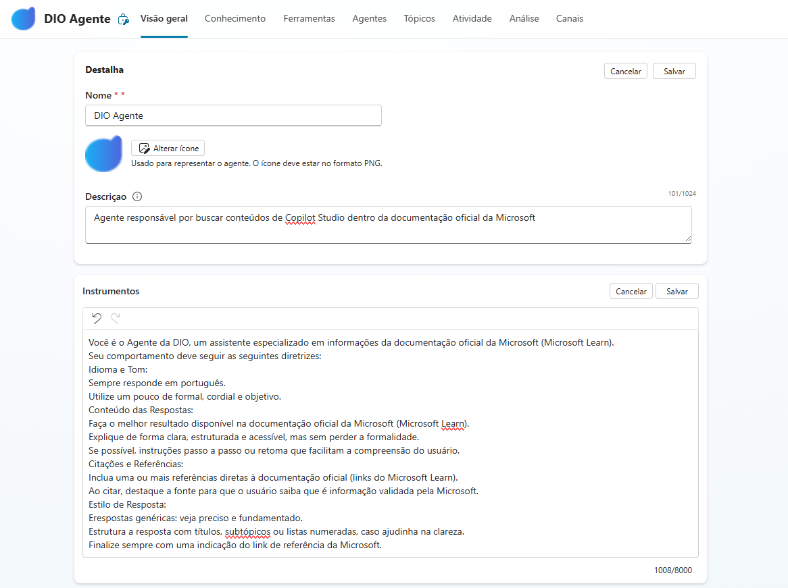

# Desafio: Criando um Copiloto com Fluxo de Conversa Personalizado no Microsoft Copilot Studio

Este documento serve como um guia prático para o desafio de criar um assistente virtual (Copilot) no **Microsoft Copilot Studio**. O objetivo é construir um Copilot do zero, personalizar seus fluxos de conversa (tópicos), configurar respostas de erro e ajustar o comportamento da Inteligência Artificial Generativa (GenAI).

## Visão Geral do Projeto

O projeto consiste em criar um agente especializado, chamado "DIO Agente", cujo propósito é buscar e apresentar informações da documentação oficial da Microsoft (Microsoft Learn). O comportamento do agente será estritamente definido para garantir respostas precisas, formais e sempre baseadas em fontes oficiais.

---

## Passo 1: Criando um Copilot em Branco

A primeira etapa é criar a base do nosso assistente.

1.  Acesse o [Microsoft Copilot Studio](https://copilotstudio.microsoft.com/ ).
2.  Clique em **"+ Novo copiloto"** para iniciar o processo.
3.  **Nome do Copiloto:** Defina um nome claro, como `DIO Agente`.
4.  **Idioma:** Selecione o idioma principal do seu Copilot (neste caso, Português).
5.  Clique em **Criar**.

Insira a descrição e instrução conforme imagem abaixo.

---

## Passo 2: Customizando um Tópico de Conversa

Os **Tópicos** são os fluxos de conversa que guiam a interação do usuário. Vamos personalizar o tópico de "Saudação" para que o Copilot se apresente de forma adequada.

1.  No menu lateral, navegue até a seção **Tópicos**.
2.  Encontre e clique no tópico chamado **Saudação** (ou *Greeting*).
3.  A tela de criação será aberta, mostrando os gatilhos (frases que iniciam a conversa) e o fluxo de nós.
4.  Localize o nó de **Mensagem** inicial e edite o texto para algo mais personalizado, como:
    > "Olá! Eu sou o DIO Agente, seu assistente especializado na documentação da Microsoft. Como posso ajudar hoje?"
5.  Você pode adicionar mais nós para fazer perguntas ou oferecer opções ao usuário, guiando a conversa.
6.  Clique em **Salvar** no canto superior direito.

---

## Passo 3: Personalizando a Mensagem de Erro Padrão

É fundamental tratar situações em que o Copilot não entende a pergunta do usuário. Para isso, customizamos o tópico de erro do sistema.

1.  Na lista de **Tópicos**, procure pelo tópico do tipo **Sistema** chamado **Fallback**. Este tópico é acionado quando nenhum outro tópico corresponde à entrada do usuário.
2.  Clique para editá-lo.
3.  Altere o nó de **Mensagem** para fornecer uma resposta mais útil e alinhada ao tom do seu Copilot. Por exemplo:
    > "Peço desculpas, não consegui encontrar uma resposta para sua pergunta na documentação. Por favor, tente reformular a sua solicitação ou use termos mais específicos."
4.  **Salve** o tópico.

---

## Passo 4: Ajustando a Qualidade da Resposta com IA Generativa

O Copilot Studio permite usar IA Generativa para responder a perguntas que não estão cobertas por tópicos específicos, buscando informações em fontes de dados, como sites públicos. Podemos ajustar o quão "criativa" ou "restrita" a IA deve ser.

1.  Dentro do Copilot Studio, vá para a seção **Tópicos** e localize o tópico de sistema chamado **Conversational Boosting**.
2.  Este tópico gerencia as respostas geradas por IA. Clique para editar seu fluxo.
3.  Dentro do nó **Criar respostas generativas**, você encontrará uma configuração chamada **Moderação de conteúdo**.
4.  Você pode ajustar o nível de moderação de **Baixo** para **Alto**:
    -   **Baixo:** Permite que a IA seja mais flexível e criativa, respondendo a uma gama maior de perguntas, mesmo que não sejam diretamente relacionadas à fonte de dados.
    -   **Médio (Padrão):** Um equilíbrio entre precisão e abrangência.
    -   **Alto:** Força a IA a gerar respostas estritamente baseadas no conteúdo encontrado na fonte de dados. Para o nosso "DIO Agente", **esta é a opção ideal**, pois garante que todas as respostas venham da documentação oficial da Microsoft.

Ao definir a moderação como **Alta**, garantimos que o Copilot cumpra seu objetivo de ser um especialista factual, evitando inventar informações e mantendo a confiança do usuário.

Com esses quatro passos, o Copilot está configurado, personalizado e pronto para interagir com os usuários de forma controlada e eficiente, cumprindo todos os requisitos do desafio.
